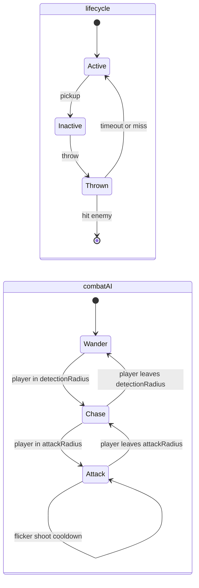
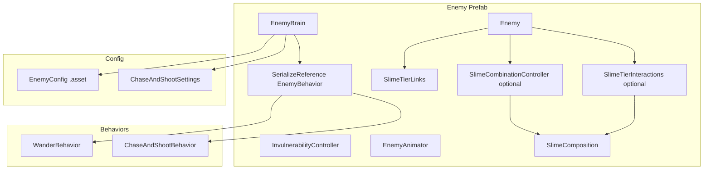
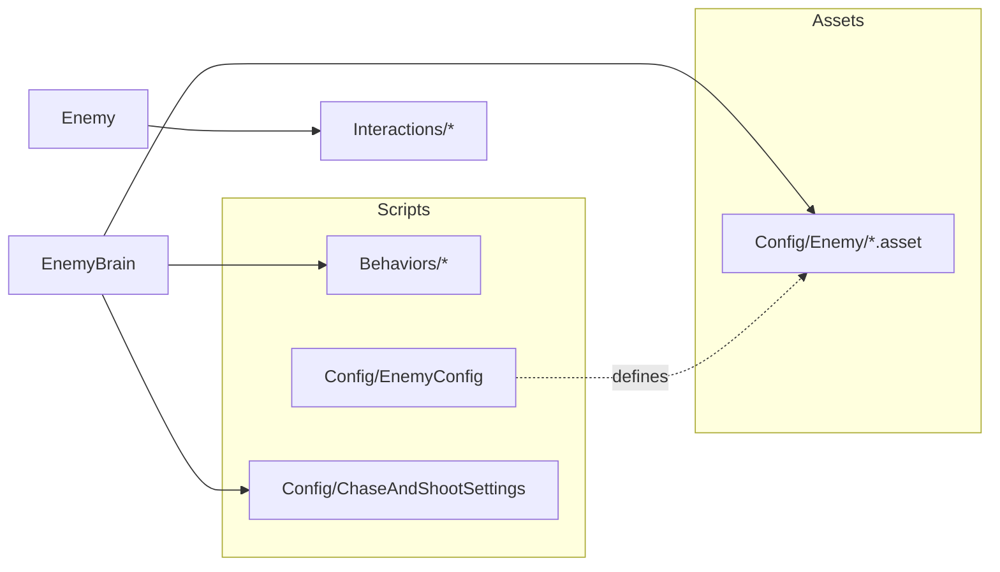

# Enemy Framework

Composable enemy architecture for Huck Amok. Enemies share lifecycle and throw/pickup rules; per-type AI and tier interactions are plugged in via composition.

## Script layout

```
Assets/Scripts/Enemy/
├── Core/                    # Lifecycle + orchestration (MonoBehaviours on prefab)
│   ├── Enemy.cs
│   ├── EnemyBrain.cs
│   ├── EnemyContext.cs
│   ├── EnemyState.cs
│   └── EnemyTier.cs
├── Behaviors/               # AI strategies ([Serializable] classes, not MonoBehaviours)
│   ├── EnemyBehavior.cs
│   ├── WanderBehavior.cs
│   └── ChaseAndShootBehavior.cs
├── Config/                  # Data types (C# only; .asset files live elsewhere)
│   ├── EnemyConfig.cs
│   └── ChaseAndShootSettings.cs
├── Interactions/            # Tier-specific pickup / thrown-hit / combine rules
│   ├── IEnemyPickupHandler.cs
│   ├── IEnemyHitHandler.cs
│   ├── SlimeTierLinks.cs
│   ├── SlimeTierInteractions.cs
│   ├── SlimeCombinationController.cs
│   ├── SlimeComposition.cs
│   └── SlimeSpawnHelper.cs
└── Presentation/
    └── EnemyAnimator.cs

Assets/Scripts/Combat/       # Shared combat utilities
├── IDamageable.cs
├── PlayerHealth.cs
└── InvulnerabilityController.cs

Assets/Config/Enemy/         # ScriptableObject tuning assets
├── Tier1SlimeConfig.asset
├── Tier2SlimeConfig.asset
└── Tier3SlimeConfig.asset
```

## Two-layer state model

Lifecycle and combat AI are intentionally separate. Throw physics and pickup do not live inside behavior classes.



| Layer | Where it lives | Examples |
|-------|----------------|----------|
| **Lifecycle** | `Enemy` | Active, Inactive, Thrown |
| **Combat AI** | `EnemyBehavior` subclasses | Wander, Chase, Flicker, Shoot |

`EnemyBrain` only ticks behaviors while `Enemy` is `Active`. Lifecycle pauses AI when Inactive or Thrown. `InvulnerabilityController` can gate pickup and AI during i-frames.

## Composition overview



- **Tier-1 slime prefab**: `Enemy` + `WanderBehavior` + `Tier1SlimeConfig` + `SlimeTierLinks` + `SlimeCombinationController`
- **Tier-2 slime prefab**: `Enemy` + `ChaseAndShootBehavior` + `Tier2SlimeConfig` + `SlimeTierLinks` + `SlimeTierInteractions`
- **Tier-3 slime prefab**: `Enemy` + `ChaseAndShootBehavior` + `Tier3SlimeConfig` + `SlimeTierLinks` + `SlimeTierInteractions`
- **Future enemy**: new behavior class + config asset (+ optional interactions handler)

## Behaviors vs Config vs Interactions



| Piece | Role | Add when |
|-------|------|----------|
| **Behaviors** | Code — how the enemy thinks and moves | New AI pattern |
| **Config** | Data — speeds, radii, prefab refs | New tunable enemy type |
| **Interactions** | Exceptions to default pickup/throw rules | Split, downgrade, special hit logic |

Behaviors should stay tier-agnostic when possible. Push tier-specific rules into `Interactions/`.

## Core types

| Type | Responsibility |
|------|----------------|
| `Enemy` | Lifecycle, movement application, throw collision routing, `EnemyTier` |
| `EnemyBrain` | Builds `EnemyContext`, calls `EnemyBehavior.Tick()` each frame |
| `EnemyBehavior` | Abstract AI: `OnEnable`, `Tick`, `OnDisable` |
| `EnemyConfig` | ScriptableObject with shared tuning fields |
| `EnemyContext` | Per-tick API: distances, `Move`, `Chase`, `Stop`, `SpawnProjectile`, `SetFlicker` |
| `ChaseAndShootSettings` | Serializable per-prefab overrides for chase/shoot slime tuning |
| `SlimeTierLinks` | Prefab graph for one-tier-up, one-tier-down, pickup piece, and pickup remainder |
| `SlimeTierInteractions` | Generic tier split/downgrade handler driven by `SlimeTierLinks` |
| `SlimeCombinationController` | Tier-1 seek/blink/combine behavior that spawns the linked tier-up prefab |
| `SlimeSpawnHelper` | Central spawn path for slimes; future composition data should pass through here |
| `SlimeComposition` | Placeholder for v0.6 type slots, so tier-N slimes can remember which slime types combined |
| `IEnemyPickupHandler` | Optional custom pickup (e.g. tier split) |
| `IEnemyHitHandler` | Optional custom thrown-hit (e.g. tier downgrade) |
| `InvulnerabilityController` | Shared i-frames + flash visual |

## Numeric tiers

`EnemyTier` uses explicit numeric values (`Tier1 = 1`, `Tier2 = 2`, `Tier3 = 3`). Use the enum when tier is identity, and cast to `int` only for tier arithmetic like slot count, one-tier downgrade, or one-tier upgrade checks. Avoid size names in code so new tiers remain numerically extensible.

## Configuring an enemy

### Shared asset

Edit `Assets/Config/Enemy/<Type>Config.asset`. Duplicate for new enemy types.

### Per-prefab overrides (shooting slimes)

On `EnemyBrain`:

1. Assign **Config** asset.
2. Enable **Use Chase And Shoot Overrides** for `ChaseAndShootBehavior` enemies.
3. Tune **Chase And Shoot Overrides** in the Inspector without editing the shared asset.

## Extension checklist

### New AI only (same tier rules)

1. Add `Behaviors/MyBehavior.cs` extending `EnemyBehavior`.
2. Assign via `[SerializeReference]` on `EnemyBrain` (editor script or prefab).
3. Reuse or duplicate an `EnemyConfig` asset.

### New tier with pickup/hit rules

1. Add the next numeric value to `EnemyTier`.
2. Duplicate the previous tier shell prefab and config.
3. Wire `SlimeTierLinks` with `tierDownPrefab`, optional `tierUpPrefab`, `pickupPiecePrefab`, and `pickupRemainderPrefab`.
4. Use `SlimeTierInteractions` for pickup/hit behavior unless the tier needs a nonstandard rule.

### Slime types later

`SlimeTierLinks` should continue to point at tier shell prefabs, not every color/type combination. When v0.6 adds slime types, `SlimeComposition` should carry the ordered type slots and `SlimeSpawnHelper` should apply merged/split composition data after instantiating the tier shell prefab.

### More complex enemies later

- **Composite behaviors** — priority list on `EnemyBrain` (e.g. flee overrides chase).
- **Nested substates** — internal enum inside one `EnemyBehavior` class.
- **Config graphs** — `EnemyConfig` references child config assets for movement vs attack.

## Naming conventions

| Suffix | Use for |
|--------|---------|
| `*Behavior` | AI strategy classes |
| `*Config` | ScriptableObject tuning assets and their C# type |
| `*Settings` | Serializable Inspector override blocks |
| `*Interactions` | Handler components for pickup/throw exceptions |
| `*Links` | Prefab graph data for tier transitions |

## Related docs

- [Project plan](project_plan.md) — version requirements (v0.3 stacked enemies, v0.4 damage)
- [Animation setup](animation_setup.md) — player animator patterns (enemies use `EnemyAnimator` frame cycling instead)
